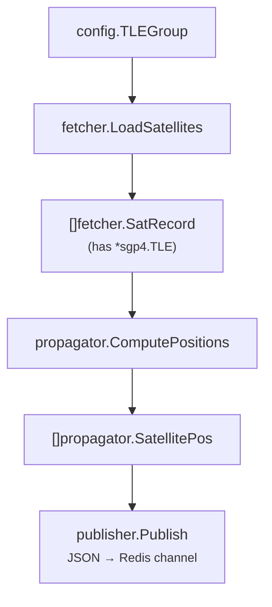

# 01 — The Go worker (`satellite-worker`)

> What this document teaches (Go concepts, in order):
> 1. `cmd/` and `internal/` project layout
> 2. Config from environment variables
> 3. Structs and JSON tags
> 4. Multiple return values `(T, error)` and `%w` error wrapping
> 5. Interfaces — depend on abstractions
> 6. Package exports (upper vs lower case)
> 7. `signal.NotifyContext` → graceful shutdown
> 8. `time.NewTicker` + `select` loop
> 9. HTTP client with retry/backoff
> 10. Why this worker has NO goroutines

## The folder layout

```
satellite-worker/
├── cmd/satellite-worker/main.go   ← entry point (The "composer")
├── internal/
│   ├── config/      ← reads env vars
│   ├── fetcher/     ← talks to CelesTrak
│   ├── propagator/  ← SGP4 math
│   └── publisher/   ← talks to Redis
├── go.mod
└── go.sum
```

Two naming conventions worth memorizing:

- **`cmd/<name>/`** — lives one `main` per binary. A real project can have
  `cmd/api`, `cmd/worker`, `cmd/cli`, each producing its own executable. `main`
  is kept tiny on purpose: it only *wires* things together.
- **`internal/`** — code that cannot be imported from outside this module.
  Go enforces this at compile time. It's the way to say "these packages are
  private". Any folder *outside* `internal/` is public API.

Go is **explicit about dependencies**. Packages may only be named once at the
top of each file, and you must use every import (the compiler errors otherwise).

## Using a separate `main.go` as the composer

`cmd/satellite-worker/main.go` does no real work by itself. It:

```go
func main() {
	ctx, stop := signal.NotifyContext(context.Background(), syscall.SIGINT, syscall.SIGTERM)
	defer stop()

	cfg := config.Load()
	pub, err := publisher.NewRedis(cfg.RedisAddr)
	...
	sats, err := fetcher.LoadSatellites(cfg.Groups)
	...
	ticker := time.NewTicker(1 * time.Second)
	defer ticker.Stop()

	for {
		select {
		case <-ctx.Done():
			return
		case now := <-ticker.C:
			positions := propagator.ComputePositions(sats, now.UTC())
			publisher.Publish(ctx, pub, cfg.Channel, positions)
		}
	}
}
```

This is the "composition root": the only place where all packages meet.
`config`, `fetcher`, `propagator` and `publisher` never import each other
(except through the types they exchange). Keeping `main` dumb makes the rest of
the code testable — you can call any package function directly from a test.

## Config from environment variables

`internal/config/config.go`:

```go
func Load() Config {
	return Config{
		RedisAddr: envOr("REDIS_ADDR", "localhost:6379"),
		Channel:   envOr("REDIS_CHANNEL", "satellite:positions"),
		Groups:    []TLEGroup{ ... },
	}
}

func envOr(key, fallback string) string {
	if v := os.Getenv(key); v != "" {
		return v
	}
	return fallback
}
```

Points to absorb:

- **Config is a plain struct**, not a class with behavior.
- `envOr` returns the env value or a fallback, so the worker runs with **zero
  setup** locally and is **configurable in the cloud** (Heroku/Render/CI).
- `envOr` starts lowercase → it is **unexported** (private), while `Load` is
  exported. That's the entire "visibility system" in Go: **capitalize = public**.

## Structs and JSON tags

In `internal/propagator/propagator.go`:

```go
type SatellitePos struct {
	ID    int     `json:"id"`
	Name  string  `json:"name"`
	Lat   float64 `json:"lat"`
	Lon   float64 `json:"lon"`
	Alt   float64 `json:"alt"`
	Group string  `json:"group"`
}
```

The backtick part (`` `json:"id"` ``) is a **struct tag** — metadata read at
runtime by reflection. `encoding/json` uses it to decide the field name when
marshaling/unmarshaling.

- Without tags, `ID` would serialize as `"ID"` (the Go field name) — which the
  frontend doesn't expect. Tags let Go keep idiomatic `ID`/`Lat` field names
  while producing web-friendly `id`/`lat` JSON.
- **Exporting a field is required** for `json.Marshal` to see it. That's why
  every field is capitalized even though we only serialize.

## Multiple return values: the `(T, error)` pattern

Go functions can return several values. The convention is:
**return the value, then an error. If error is not `nil`, the value is
meaningless.**

```go
func LoadSatellites(groups []config.TLEGroup) ([]SatRecord, error)
func NewRedis(addr string) (*redisPublisher, error)
func (p *redisPublisher) Publish(ctx context.Context, channel string, data []byte) error
```

And errors wrap the message from deeper down for context:

```go
return nil, fmt.Errorf("parsing OMMs: %w", err)
```

- `%w` **wraps** the original error so you can later unwrap it with
  `errors.Is`/`errors.As`.
- Compare with JavaScript, where errors are usually `throw`n and caught — Go
  instead returns them so call sites are forced to handle them.

## Interfaces — depend on abstractions

`internal/publisher/redis.go`:

```go
type Publisher interface {
	Publish(ctx context.Context, channel string, data []byte) error
}

func Publish(ctx context.Context, pub Publisher, channel string, positions []propagator.SatellitePos) error {
	data, err := json.Marshal(positions)
	if err != nil {
		return fmt.Errorf("marshaling positions: %w", err)
	}
	return pub.Publish(ctx, channel, data)
}
```

Key idea (Go is *structural*, not *nominal* typing here):

- `Publish` receives a `Publisher` **interface**, not a concrete
  `*redisPublisher`.
- Whoever has a `Publish(ctx, channel, data)` method **implicitly satisfies**
  the interface — no `implements` keyword. `*redisPublisher` satisfies it by
  having exactly that method.
- Benefit: you can test `Publish` with a fake publisher, or swap Redis for
  Kafka/Postgres later, without touching the caller.

## Graceful shutdown with `signal.NotifyContext`

```go
ctx, stop := signal.NotifyContext(context.Background(), syscall.SIGINT, syscall.SIGTERM)
defer stop()
```

- `SIGINT` = Ctrl+C, `SIGTERM` = the "please stop" from a container/Render.
- Whenever one arrives, the returned `ctx` gets cancelled.
- The `select` below sees `<-ctx.Done()` and returns, which triggers `defer`
  calls (ticker stop, Redis connection close).
- Without this, killing the worker just aborts abruptly — connections leak and
  the container gets a forced kill.

## The ticker + select loop

```go
ticker := time.NewTicker(1 * time.Second)
defer ticker.Stop()

for {
	select {
	case <-ctx.Done():
		return
	case now := <-ticker.C:
		positions := propagator.ComputePositions(sats, now.UTC())
		publisher.Publish(ctx, pub, cfg.Channel, positions)
	}
}
```

- `ticker.C` is a **channel** that delivers the current time every 1s.
- `select` blocks until one of the channels is ready — either the tick fired or
  the context was cancelled. This is the idiomatic way to run a periodic task
  that can still stop cleanly.
- `now.UTC()` matters: satellite math uses absolute time, and messing with
  local timezones here would shift every satellite.

## HTTP client with retry/backoff

`internal/fetcher/fetcher.go`:

```go
var defaultHTTPClient = &http.Client{Timeout: 30 * time.Second}

func fetchOMMData(url string, retries int) ([]sgp4.OMM, error) {
	for attempt := 0; attempt <= retries; attempt++ {
		omms, err := fetchOMMOnce(url)
		if err != nil {
			if attempt < retries {
				time.Sleep(5 * time.Second)
				continue
			}
			return nil, err
		}
		return omms, nil
	}
	return nil, nil
}
```

- `http.Client` is reused — creating a client per request is wasteful.
- The `Timeout` prevents a hung Celestrak connection from blocking forever.
- Retry loop with a fixed 5s backoff: transient network hiccups don't kill the
  satellite load.

## Why this worker has NO goroutines

`go func(){}` is everyone's first reflex with Go. But look at the data flow in
`main.go` — it's a **single sequential loop**: tick → compute → publish → tick.
There's nothing to parallelize.

- Adding goroutines here would add locking, ordering issues and bugs, not
  speed.
- The single-threaded loop is deterministic and trivially debuggable.
- **Lesson:** concurrency is a tool, not a default. If the propagator had to
  handle thousands of satellites in one second, *then* you'd shard the work
  across goroutines with a `sync.WaitGroup`.

## How the data pieces connect (mental map)



- `fetcher` knows how to **get** data.
- `propagator` knows how to **compute** positions.
- `publisher` knows how to **send** results.
- `config` knows what the operator wants.
- `main` knows the **order** of all of it.

## Questions to test yourself

1. What happens if you rename `Load` to `load` in `config.go`?
2. Why does `json.Marshal` not see lowercase fields?
3. In `propagator.ComputePositions`, why is indexing `sats[i]` done via
   `for i := range sats` instead of `for _, sat := range sats`?
4. Can `internal/config` import `internal/publisher`? (Hint: think about the
   dependency direction shown in the mental map above.)
5. What would you change to publish every **500ms**? Every **10s**?

---
Next: [02-node-ws-server.md](02-node-ws-server.md)