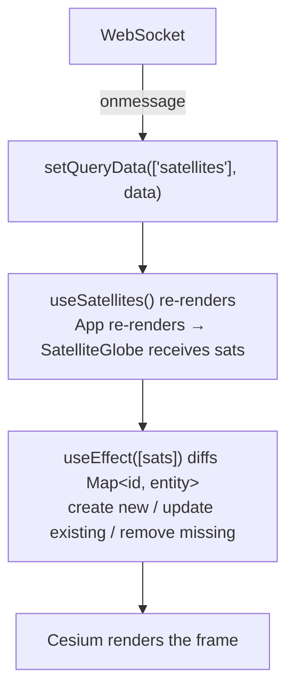

# 03 — The React frontend (`frontend`)

> What this document teaches (React + TypeScript concepts, in order):
> 1. Vite + React 19 + TypeScript + Tailwind — the toolchain
> 2. `main.tsx` and the React Query client (a global cache, not a fetcher)
> 3. Hooks by role: `useState`, `useRef`, `useEffect`, `useCallback`, `useMemo`,
>    `useLayoutEffect`
> 4. The "refs as bridge to the imperative world" pattern (Cesium)
> 5. Custom hooks to hide complexity (`useSatellites`,
>    `useSatelliteWebSocket`, `useFullscreen`)
> 6. One-way data flow and lifting state up (`App.tsx`)
> 7. WebSocket → React Query cache → re-render pipeline
> 8. Event listeners that must be cleaned up
> 9. Rendering on the 3D globe: viewer, entities, billboards, picking
> 10. Environment config with `VITE_*`

## The toolchain in one paragraph

`index.html` loads `Cesium.js` from a CDN and a `<script type="module">` points
to `src/main.tsx`. **Vite** dev-serves and bundles it. React 19 renders the UI.
Tailwind CSS v4 styles it with utility classes. TypeScript type-checks
everything (`tsc -b` before `vite build`).

```
frontend/
├── index.html
├── src/
│   ├── main.tsx                     ← app bootstrap + query client
│   ├── App.tsx                      ← state + composition
│   ├── @types/types.ts              ← shared domain types
│   ├── hooks/
│   │   ├── useSatellites.ts         ← reads the cache
│   │   ├── useSatelliteWebSocket.ts ← feeds the cache
│   │   └── useFullscreen.ts         ← browser fullscreen API
│   └── components/
│       ├── ControlPanel.tsx         ← sidebar UI
│       ├── Tooltip.tsx              ← clicked satellite info
│       └── SatelliteGlobe/
│           ├── index.tsx            ← the Cesium component
│           └── utils/
│               ├── viewer.ts        ← Cesium Viewer factory
│               ├── satelliteMapUtils.ts ← entity create/update
│               ├── pick.ts          ← click → satellite detection
│               └── icons.ts         ← dynamic SVG data URIs
```

## `main.tsx` and the query client — a cache, not a fetch library

```tsx
const queryClient = new QueryClient({
  defaultOptions: {
    queries: {
      staleTime: Number.POSITIVE_INFINITY,
      refetchOnWindowFocus: false,
      refetchOnReconnect: false,
    },
  },
})

createRoot(document.getElementById('root')!).render(
  <StrictMode>
    <QueryClientProvider client={queryClient}>
      <App />
    </QueryClientProvider>
  </StrictMode>,
)
```

Normally TanStack Query *fetches* from an API. Here it's used as a **write-only
global store**: the WebSocket pushes data in (via `setQueryData`), everything
else reads it. That's why queries never refetch, focus/refetch/reconnect are
off, and `staleTime` is infinite — the socket is the single source of truth.

Two React details to note:

- `createRoot(document.getElementById('root')!)` — the `!` is TypeScript's
  **non-null assertion**: "I promise this element exists".
- `<StrictMode>` double-invokes effects in dev to catch bugs — which is why the
  WebSocket hook must tolerate being mounted/unmounted twice.

## Reading and writing the cache: two hooks, one key

`src/hooks/useSatellites.ts`:

```ts
export const SATELLITES_KEY = ['satellites'] as const

export const useSatellites = () => {
  const query = useQuery<SatellitePos[]>({
    queryKey: SATELLITES_KEY,
    initialData: [],
  })
  return query.data ?? []
}
```

`src/hooks/useSatelliteWebSocket.ts` writes to that same key:

```ts
queryClient.setQueryData(SATELLITES_KEY, data)
```

- The **key is shared** — that's how reader and writer agree on which slot to
  use without passing props through the whole tree. No prop drilling at all for
  satellite data.
- `initialData: []` means the app renders an empty globe on first paint instead
  of a loading spinner.
- `?? []` guards against an undefined cache entry.
- `as const` makes the array a literal tuple type instead of `string[]`, giving
  exact typing for `queryKey`.

## Hooks by role — the mental checklist

| Hook | Job | Where it appears |
|---|---|---|
| `useState` | Track UI state that triggers re-render | `App.tsx` (panelOpen, selectedSatId), `Tooltip` (implicit via props) |
| `useRef` | Hold mutable data that does **not** trigger re-render; access DOM nodes | `viewerRef`, `entitiesRef`, `satsRef`, `containerRef` |
| `useEffect` | Run side effects after render; subscribe/unsubscribe | creating the viewer, listeners, WebSocket |
| `useCallback` | Memoize a function identity so children don't re-render needlessly | `toggleGroup`, `toggleFullscreen` |
| `useMemo` | Compute expensive value only when deps change | `groupCounts` in ControlPanel |
| `useLayoutEffect` | Run layout-affecting code before the browser paints | Tooltip positioning |

The golden rule: **state that must survive re-renders without triggering them
→ `useRef`; state that must trigger re-renders → `useState`.** The globe keeps
views in refs precisely because Cesium handles its own redraws.

## The "refs as bridge to the imperative world" pattern

This is the core idea of `SatelliteGlobe/index.tsx`. React is *declarative*;
Cesium is *imperative* (you call `viewer.entities.add(...)` and it mutates
state). The bridge:

```tsx
const viewerRef = useRef<CesiumNS.Viewer | null>(null)
const entitiesRef = useRef<Map<number, CesiumNS.Entity>>(new Map())

useEffect(() => {
  const viewer = createViewer(containerRef.current!)
  viewerRef.current = viewer
  ...
  return () => { viewer.destroy() }   // cleanup on unmount
}, [])
```

- `containerRef` (a ref on a `<div>`) hands the real DOM node to Cesium.
- `viewerRef` survives re-renders, so other effects/callbacks can reach the
  viewer without re-creating it.
- The `useEffect([])` runs **once** on mount and its return function is the
  **cleanup** — symmetric with the mount.

## One-way data flow and lifting state up

`App.tsx` owns all "app-level" state and passes it **down**:

```tsx
const [activeGroups, setActiveGroups] = useState<ReadonlySet<SatelliteGroup>>(
  () => new Set(GROUPS),
)
const [selectedSatId, setSelectedSatId] = useState<number | null>(null)
const [panelOpen, setPanelOpen] = useState(true)

return (
  <SatelliteGlobe
    sats={sats}
    activeGroups={activeGroups}
    selectedSatId={selectedSatId}
    onSelectSat={setSelectedSatId}
  />
  ...
)
```

- Data flows **down** through props; events flow **up** through callbacks
  (`onSelectSat`).
- `selectedSatId` lives in `App` because both `SatelliteGlobe` (highlight) and
  `ControlPanel` (could show it) share it — this is "lifting state up".
- `ReadonlySet` communicates "you may read, not mutate"; mutations happen only
  via `setActiveGroups`.
- `toggleGroup` is wrapped in `useCallback` so its identity is stable between
  renders — otherwise `ControlPanel` (which receives `onToggleGroup` as a prop)
  would re-render on every keystroke.

## WebSocket → cache → re-render pipeline

`useSatelliteWebSocket.ts`:

```ts
socket.onmessage = (event) => {
  if (disposed) return
  const data = JSON.parse(event.data) as SatellitePos[]
  queryClient.setQueryData(SATELLITES_KEY, data)   // 1. write to cache
  setLastUpdate(new Date())                         // 2. notify ControlPanel
}
```

Every second: **1** the cache is overwritten → **2** `useSatellites()`
subscribers re-render with fresh data → `SatelliteGlobe`'s `useEffect` (deps
`[sats]`) diffs entities and calls `updateSatellitePosition` on existing ones
**without rebuilding the whole globe** (see below).

Reconnection logic lives in the same hook:

```ts
socket.onclose = () => {
  setStatus('disconnected')
  retryTimer.current = window.setTimeout(connect, RECONNECT_DELAY)
}
```

- `RECONNECT_DELAY = 3000` — try again in 3s, forever.
- Everything is cleaned on unmount/`dispose`, so the infinite retry loop can't
  leak when the component leaves the screen.

## Event listeners must be cleaned up

```ts
container.addEventListener('click', onClick)
container.addEventListener('mousemove', onMouseMove)

return () => {
  container.removeEventListener('click', onClick)
  container.removeEventListener('mousemove', onMouseMove)
  ...
}
```

Symmetric add/remove prevents listeners accumulating across unmounts (a classic
memory leak and duplicate-handler bug in React apps).

## Rendering on the 3D globe

`utils/viewer.ts` builds the Cesium `Viewer`: Esri World Imagery as the base
layer, a Tycho star-catalog skybox, and every default widget hidden.

`utils/satelliteMapUtils.ts` is the entity manager:

```ts
const createSatelliteEntity = (viewer, sat): CesiumNS.Entity => {
  return viewer.entities.add({
    id: `sat_${sat.id}`,
    position: new Cesium.ConstantPositionProperty(
      satPosition({ lon: sat.lon, lat: sat.lat, alt: sat.alt }),
    ),
    billboard: { image: satSvgDataUri(color), ... },
    label: { text: sat.name, ... },
  })
}
```

- `id` is **stable** (`sat_<noradId>`) so the component can diff by id instead
  of recreating everything each second.
- **create vs update**: `SatelliteGlobe` keeps a `Map<id, entity>`; if the id
  exists it calls `updateSatellitePosition` (just moves the billboard), if not
  it creates a new entity. This is *reconciliation done by hand* — the essence
  of what React does with the DOM, applied to a retained-mode 3D API.
- The **highlight ring** is a second entity type (`createHighlightEntity`)
  drawn as an ellipse around the selected satellite.

`utils/pick.ts` answers "did the user click a satellite?":

```ts
for (const [, sat] of sats) {
  const cart3 = Cesium.Cartesian3.fromDegrees(sat.lon, sat.lat, sat.alt * 1000)
  const windowCoord = Cesium.SceneTransforms.wgs84ToWindowCoordinates(viewer.scene, cart3)
  ... // project 3D → screen, pick the closest within a 24px radius
}
```

It projects every satellite's world position to **window coordinates** and
returns the nearest one inside `PICK_RADIUS = 24` — no complex picking API
needed for a handful of objects.

`utils/icons.ts` generates the colored dot: a small SVG string converted to a
`data:` URI, parameterized by the group color. Because it's generated with the
group color interpolated, we get one icon per color without shipping 5 files.

## Environment config with `VITE_*`

`wsUrl()` in `useSatelliteWebSocket.ts`:

```ts
const wsUrl = (): string => {
  const custom = import.meta.env.VITE_WS_URL as string | undefined
  if (custom) return `${custom.replace(/\/+$/, '')}/ws`
  const proto = location.protocol === 'https:' ? 'wss' : 'ws'
  return `${proto}://${location.host}/ws`
}
```

- Vite exposes `.env` files that start with `VITE_` in `import.meta.env`.
- In the cloud (Vercel) `VITE_WS_URL` points at the Render server; locally it's
  unset and the app falls back to `location.host` (which works with Vite's
  `/ws` proxy). This single switch is what makes local dev and production
  deployment share one codebase.

## The complete React data flow



## Questions to test yourself

1. Why does `SatelliteGlobe` store `viewerRef`/`entitiesRef` in refs instead
   of `useState`?
2. What would happen if `useSatelliteWebSocket` did NOT return a cleanup that
   closes the socket?
3. In `App.tsx`, why is `toggleGroup` passed with `useCallback` but
   `onSelectSat={setSelectedSatId}` directly? (Hint: what does a `setState`
   return and how stable is its identity?)
4. If the server never sent a message again, would the globe freeze or keep
   orbiting? What about the "last update" clock in ControlPanel?
5. The entity diff implements reconciliation manually. When would this become
   too slow, and what would the Cesium-native fix be (hint: `DataSource` /
   batching)?

---
Back to: [00-architecture.md](00-architecture.md)