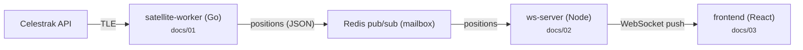

# Documentation

Step-by-step walkthroughs of the whole **Live Satellite Tracker** project,
written to consolidate Go, Node.js and React knowledge.

## How to read

Read the files **in order**. Each builds on the previous.

| # | Doc | What you'll learn |
|---|---|---|
| [00-architecture.md](00-architecture.md) | The whole system and why it's split into 3 services | pub/sub, WebSocket, JSON as a contract, end-to-end data flow |
| [01-go-worker.md](01-go-worker.md) | `satellite-worker/` | Go project layout (`cmd/`/`internal/`), `(T, error)` pattern, `%w` wrapping, interfaces, `select` + ticker, graceful shutdown, HTTP + retry/backoff |
| [02-node-ws-server.md](02-node-ws-server.md) | `ws-server/` | Node event loop, WebSocket broadcasting, Redis subscriber, `type` vs `interface`, strict TS, options-object rule, static serving + path traversal, graceful shutdown |
| [03-react-frontend.md](03-react-frontend.md) | `frontend/` | Vite + React 19 + TS, hooks by role, refs bridging to imperative Cesium, React Query as global cache fed by WebSocket, entity diffing, `VITE_*` config |

## Practical mapping

Each doc ends with **Questions to test yourself** — answer them without looking
at the code first, then check the source. That's the fastest way to make the
concepts stick.